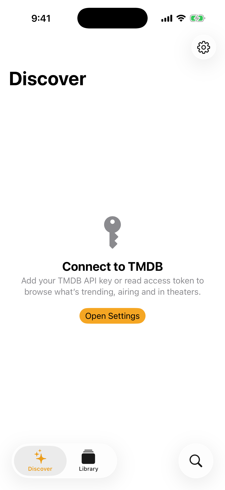
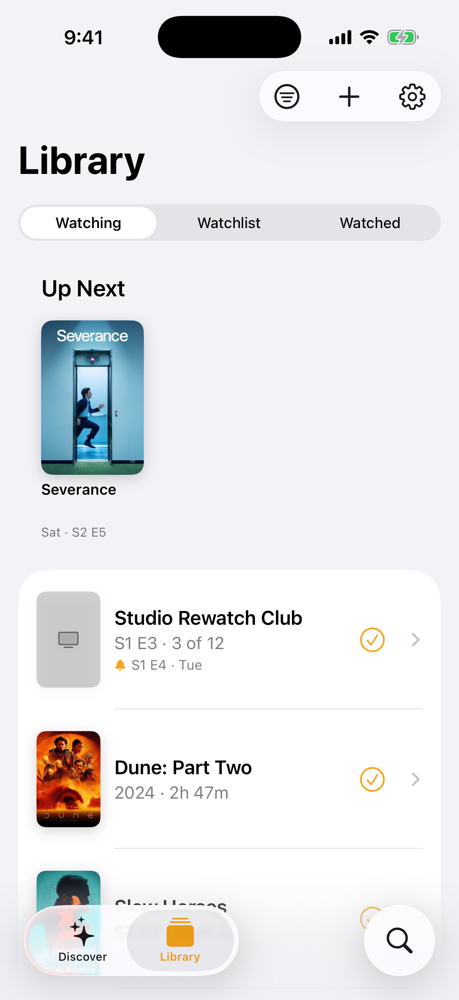
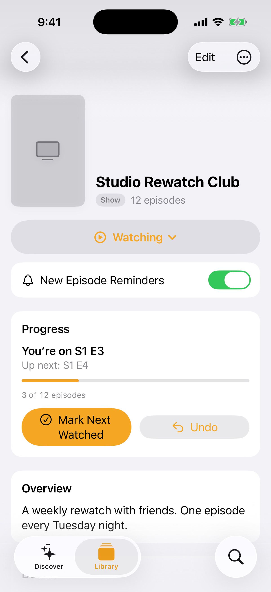

# Marquee

**Keep up with everything you're watching.** Marquee is a native iOS app that tracks the shows and movies in your life, tells you what to watch next, and reminds you the day a new episode drops.

[](https://github.com/bkravets06/Marquee/actions/workflows/ci.yml)

---

## Features

- **Discover.** Browse what's trending today, shows airing tonight and this week, movies in theaters and coming soon, and the most popular titles, all powered by [TMDB](https://www.themoviedb.org).
- **Search anything.** Find any show or movie ever aired, filter by type, and add it to your library in one tap.
- **Your library.** Sort titles into *Watching*, *Watchlist* and *Watched*, and track per-episode progress for every show, season by season.
- **Up Next and reminders.** See which of your shows have a new episode this week and get a local notification the day it airs. Reminders refresh quietly in the background.
- **Custom titles.** Track things TMDB does not know about, such as a YouTube series or a course, with your own poster, link, notes and a weekly reminder schedule.
- **Designed for iOS.** Built entirely with native SwiftUI: large titles, inset grouped lists, SF Symbols, haptics, full Dynamic Type, dark mode and a proper iPad layout. On Xcode 26 the system controls adopt Liquid Glass automatically.

## Screenshots

*Coming soon.*

<!--
| Discover | Library | Detail |
| --- | --- | --- |
|  |  |  |
-->

## Requirements

- Xcode 16 or later (Xcode 26 recommended for Liquid Glass)
- iOS 18 or later
- A free TMDB account for an API Read Access Token

## Getting started

1. Clone the repository:

   ```sh
   git clone https://github.com/bkravets06/Marquee.git
   cd Marquee
   ```

2. Open `Marquee.xcodeproj` in Xcode and run the **Marquee** scheme on a simulator or device. To run on a device, select your team under *Signing & Capabilities* for the Marquee target.

3. On first launch, Marquee walks you through onboarding and asks for a **TMDB API Read Access Token**. Create one for free at <https://www.themoviedb.org/settings/api> and paste it in. The token is stored in the iOS Keychain and never leaves your device except to talk to TMDB.

### For developers

To skip the token prompt while iterating, set the `TMDB_ACCESS_TOKEN` environment variable in the Marquee scheme (*Product → Scheme → Edit Scheme → Run → Arguments → Environment Variables*). It is only read in Debug builds and only when the Keychain has no token.

## How notifications work

Marquee schedules **local** notifications; there is no server and no account.

- For shows from TMDB, Marquee reads the *next episode to air* and schedules one notification per show at your preferred reminder time on the air date. Reminders are on by default for the shows you are watching; every show has a toggle to opt out.
- A background refresh task re-syncs your library with TMDB at most every 6 hours when iOS allows it. Each time the app comes to the foreground Marquee re-checks your reminders and re-fetches any show it has not refreshed in the last 6 hours, so reminders stay accurate as air dates change. Pull to refresh in Library, or tap **Refresh Episodes Now** in Settings, to force a full refresh.
- Custom shows use the weekly schedule you set (for example "Tuesdays at 8:00 PM") as a repeating reminder.
- Turning notifications off for a show, or removing it from your library, cancels its pending reminders.

## Architecture

Marquee is split into two pieces:

- **MarqueeKit**, a local Swift package with no UI dependencies. It contains the domain model (`MediaKind`, `WatchStatus`, `EpisodePointer`, `NextUp`, `CivilDate`, `ReleaseSchedule`, `EpisodeReminder`) and the `TMDBClient` actor with its DTOs. It builds and tests on Linux and macOS.
- **Marquee**, the iOS app. SwiftUI views organised by feature (Discover, Library, Detail, Search, Custom, Settings), SwiftData persistence through a single `LibraryStore`, and services for notifications, library refresh and background tasks.

The full contract between modules, including type names, signatures and the UI spec, lives in [docs/ARCHITECTURE.md](docs/ARCHITECTURE.md).

## Testing

Run the package tests anywhere Swift runs:

```sh
swift test --package-path MarqueeKit
```

Run the full app build and test suite on macOS:

```sh
xcodebuild -project Marquee.xcodeproj -scheme Marquee \
  -destination "platform=iOS Simulator,name=iPhone 16" \
  CODE_SIGNING_ALLOWED=NO build test
```

Continuous integration runs both on every push and pull request; see [`.github/workflows/ci.yml`](.github/workflows/ci.yml).

## Roadmap

- Home Screen and Lock Screen widgets for Up Next
- iCloud sync across devices
- Import history from Trakt
- Where-to-watch providers on the detail screen

## Attribution

This product uses the TMDB API but is not endorsed or certified by TMDB.

Marquee is an independent project and is not affiliated with, endorsed by or sponsored by Apple Inc. Apple, iOS, iPad, Xcode and SF Symbols are trademarks of Apple Inc.
